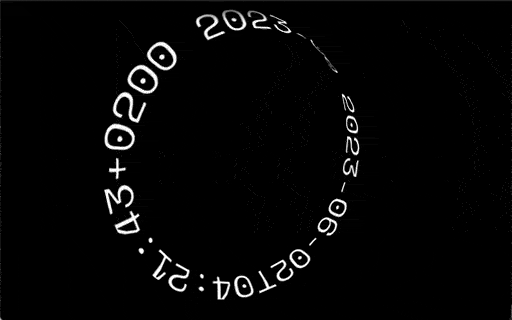
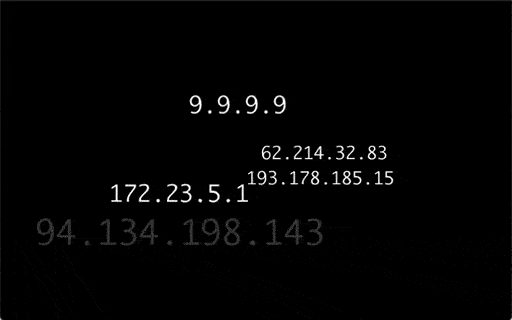

# FACADE Example Gallery
    
--

## `man` - some manual pages are quite pretty

	# Raspi
	facade render lines -w 50 -shape crawl
	
	# Host
	alias fcd='nc raspi 4045'
	MANWIDTH=50 MANPAGER=cat man nc \
	 | while read line; do echo "$line"; sleep .9; done | fcd

   

## `mtr` - visual trace route

	# Raspi
	facade render term -shape vortex
	
	# Host
	facade exec -host raspi term -w 120 -h 16 sudo mtr -m 10 --displaymode 1 9.9.9.9

## `RFC` - plaintext protocol specifications

	# Raspi
	facade render lines -w 72 -shape roll
	
	# Host
	alias fcd='nc raspi 4045'
	curl -L https://tools.ietf.org/rfc/rfc791.txt \
	 | while read -r line; do echo "$line"; sleep .9; done | fcd

## `date` - wall time

	# Raspi
	facade -d render chars -shape moebius -color moebius -w 64 -speed .5 -font spacemono
	
	# Host
	alias fcd='nc raspi 4045'
	while true; do date +"%Y-%m-%dT%H:%M:%S%z"; sleep 1; done | fcd

## `tshark` - packet captures

	# Raspi
	facade -d render words -shape field -n 32 -life 4 -mark 1 -shuffle -uniq
	
	# Host
	alias fcd='nc raspi 4045'
	sudo tshark -i wlan0 -l -T fields -e ip.src | fcd

## `asciipr0n` - nudes without the `` tag

	# Raspi
	facade render lines -w 80 -shape slate
	
	# Host
	alias fcd='nc raspi 4045'
	curl -sL https://www.asciipr0n.com/pr0n/pinups/pinup00.txt \
	 | while read -r line; do echo "$line"; sleep .5; done | fcd

## `.nfo` - demo scene release notez

	# Raspi
	facade render lines -w 80 -shape wave  -font adore64
	
	# Host
	alias fcd='nc raspi 4045'
	curl -L https://content.pouet.net/files/nfos/00012/00012031.txt \
	 | while read -r line; do echo "$line"; sleep .9; done | fcd

## `PHRACK` - philes about hacking

	# Raspi
	facade render lines -w 80 -shape roll

	# Host
	alias fcd='nc raspi 4045'
	curl -sL http://phrack.org/archives/tgz/phrack49.tar.gz \
	 | tar xfz /dev/stdin --to-stdout ./14.txt \
	 | while read -r line; do echo "$line"; sleep .9; done | fcd

--

FACADE by FEEDFACE.COM 2023-05

