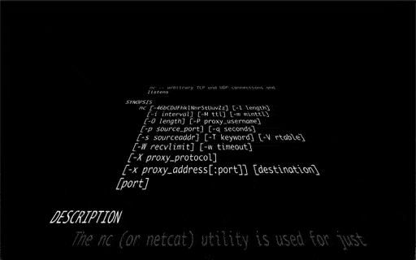
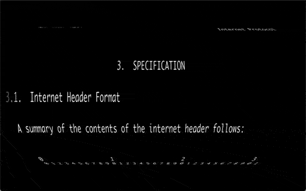
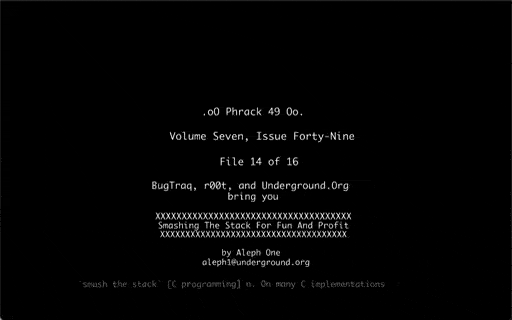
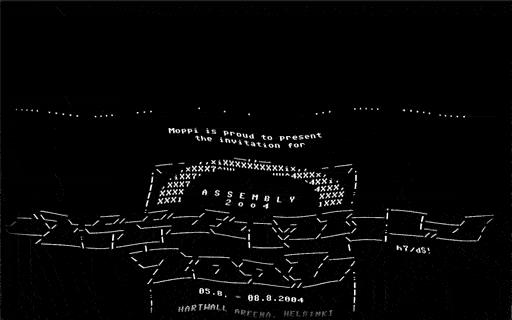
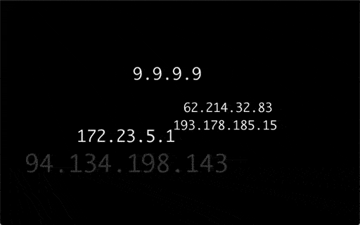
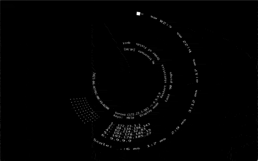

# FACADE by FEEDFACE.COM
    
pipe stdout to light

## FAQ

* ##### What is FACADE?

  FACADE is a command line tool for Raspberry Pi that reads ASCII/ANSI text from stdin or network and renders it to the display in different shapes.

* ##### What is the recommended FACADE setup?

  FACADE works best on a Raspberry Pi with an LED projector connected to the display port.  
  The FACADE renderer receives text from other hosts over wireless network and displays it on the projector.
  
	~~~
	                                                  /  H|      
	+------------------+         +--------+  +-----+ /   E|      
	| echo HELLO | fcd |.))   ((.| FACADE |--|     <     L|      
	+------------------+         +--------+  +-----+ \   L|      
	 host                         raspi     projector \  O| wall 
	~~~  

* ##### What are the FACADE requirements?  

  The FACADE renderer requires a Raspberry Pi with the Broadcom BCM libraries.  
  It is tested on the following systems:

	*  Raspberry Pi 2 - Raspbian 10 (buster) Lite
	*  Raspberry Pi 3 - Raspbian 10 (buster) Lite
	*  Raspberry Pi 3 - Raspbian 11 (bullseye) Lite
		* requires `/opt/vc/lib/*.so` from Raspbian 10

	The FACADE renderer does not require X11 and has no external dependencies on Raspbian 10.  
	The FACADE client is tested on various UNIX-like systems.

* ##### Why is FACADE?

  FACADE was created to enjoy, highlight and share the beauty of text on the terminal.

   
## Usage

* ### Render text from stdin

  On Raspberry Pi, FACADE reads text from stdin and renders to screen:

		[user@raspi ~]$ echo 'Hello, World!' | facade render -stdin lines 

	

* ### Render text from network
 
   On Raspberry Pi, FACADE reads text from network and renders to screen:

		[user@raspi ~]$ facade render lines -shape crawl

	On another machine, FACADE reads text from stdin and sends to Raspberry Pi:

		[user@host ~]$ ping -c 3 9.9.9.9 | facade pipe -host raspi 

	

* ### Send text with _netcat_

   On Raspberry Pi, FACADE reads text from network and renders to screen:

		[user@raspi ~]$ facade render words -n 1 -uniq

	On another machine, netcat reads text from stdin and sends to Raspberry Pi:

	
		[user@host ~]$ alias fcd='nc -N raspi 4045'
		[user@host ~]$ while true; do date +%T; sleep .5; done | fcd	

	

## Help System

FACADE shows available options depending on context:

*	`facade -h` shows global options, and available commands
*	`facade render -h` shows options for _render_ command, and available modes
*	`facade render lines -h`  shows options for _lines_ mode, and available styles

When the debug flag `-d` is given, more mode options are available:

*	`facade -d render lines -h`  shows all options for _lines_ mode
	

  

## Examples

* ### `man` - some manual pages are quite pretty

		# Raspi
		facade render lines -w 50 -shape crawl
		
		# Host
		MANWIDTH=50 MANPAGER=cat man nc \
		 | while read line; do echo "$line"; sleep .9; done | fcd

* ### `RFC` - plaintext protocol specifications

		# Raspi
    	facade render lines -w 72 -shape roll
		
		# Host
		curl -L https://tools.ietf.org/rfc/rfc791.txt \
		 | while read -r line; do echo "$line"; sleep .9; done | fcd

* ### `PHRACK` - philes about hacking

		# Raspi
		facade render lines -w 80 -shape roll

		# Host
		curl -sL http://phrack.org/archives/tgz/phrack49.tar.gz \
		 | tar xfz /dev/stdin --to-stdout ./14.txt \
		 | while read -r line; do echo "$line"; sleep .9; done | fcd

	
--

* ### `asciipr0n` - nudes without the `` tag

		# Raspi
		facade render lines -w 80 -shape slate
	
		# Host
		curl -sL https://www.asciipr0n.com/pr0n/pinups/pinup00.txt \
		 | while read -r line; do echo "$line"; sleep .5; done | fcd

	
--

* ### `.nfo` - demo scene release notez

		# Raspi
		facade render lines -w 80 -shape wave  -font adore64
	
		# Host
		curl -L https://content.pouet.net/files/nfos/00012/00012031.txt \
		 | while read -r line; do echo "$line"; sleep .9; done | fcd

	
--

* ### `date` - wall time

		# Raspi
		facade -d render chars -shape moebius -color moebius -w 64 -speed .5 -font spacemono
		
		# Host
		alias fcd='nc raspi 4045'
		while true; do date +"%Y-%m-%dT%H:%M:%S%z"; sleep 1; done | fcd

	

* ### `tshark` - network traffic

		# Raspi
		facade -d render words -shape field -n 32 -life 4 -mark 1 -shuffle -uniq
		
		# Host
		sudo tshark -i wlan0 -l -T fields -e ip.src | tr -u ',' '\n' | fcd

	
--

* ### `mtr` - visual trace route

		# Raspi
		facade render term -shape vortex
	
		# Host
		facade exec -host raspi term -w 120 -h 16 sudo mtr -m 10 --displaymode 1 9.9.9.9

	
--

--

FACADE by FEEDFACE.COM 2023-05

