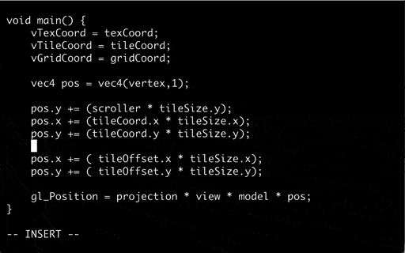

# FACADE by FEEDFACE.COM
    
*pipe stdout to light*

## FAQ

* ##### What is FACADE?

  FACADE is a service for Raspberry Pi that reads ASCII/ANSI text from stdin or network and renders it to the display in different shapes.

* ##### What is the recommended FACADE setup?

  FACADE works best on a Raspberry Pi with an LED projector connected to the display port.  
  The FACADE renderer receives text from other hosts over wireless network and displays it on the projector.
  
	~~~
	                                                  /  H|      
	+------------------+         +--------+  +-----+ /   E|      
	| echo HELLO | fcd |.))   ((.| FACADE |--|     O     L|      
	+------------------+         +--------+  +-----+ \   L|      
	 host                         raspi     projector \  O| 
	 
	~~~  

* ##### What are the FACADE requirements?  

  The FACADE renderer requires a Raspberry Pi with the Broadcom BCM libraries.  
  It is tested on the following systems:

	*  Raspberry Pi 2 - Raspbian 10 (buster) Lite
	*  Raspberry Pi 3 - Raspbian 10 (buster) Lite
	*  Raspberry Pi 3 - Raspbian 11 (bullseye) Lite
		* requires `/opt/vc/lib/*.so` from Raspbian 10

	The FACADE renderer does not require X11 and has no external dependencies on Raspbian 10.  
	The FACADE client is tested on various UNIX-like systems.

* ##### Why is FACADE?

  FACADE was created to enjoy, highlight and share the beauty of text on the terminal.  
  See the [gallery](EXAMPLES.md) for examples.

   
## Use Cases

* ### Pipe text to FACADE on stdin

  On Raspberry Pi, FACADE reads text from stdin and renders to screen:

		echo 'Hello, World!' | facade render -stdin lines 

	

* ### Pipe text to FACADE over network
 
   On Raspberry Pi, FACADE reads text from network and renders to screen:

		facade render lines -shape crawl

	On another host, text is piped to netcat and sent to the FACADE renderer on *Raspi*:

		alias fcd='nc -N raspi 4045'
		ping 9.9.9.9 | fcd

	

* ### Run process and send output to FACADE over network

   On Raspberry Pi, FACADE reads ANSI text from network and renders to screen:

		facade render term -shape disk -w 64 -h 8

	On another host, FACADE executes `htop` and sends the output to FACADE renderer on *Raspi*:

		facade exec -host raspi term /usr/bin/htop

	

## Usage

### Help System

FACADE shows available options depending on context:

*	`facade -h` shows global options, and available commands
*	`facade render -h` shows options for _render_ command, and available modes
*	`facade render lines -h`  shows options for _lines_ mode, and available styles

When the debug flag `-d` is given, more mode options are available:

*	`facade -d render lines -h`  shows all options for _lines_ mode, and available styles
	

### FACADE Commands

* `render` - receives text from stdin/network and renders to display
* `pipe` - reads text from stdin and send to remote renderer
* `conf` - configures remote renderer
* `exec` - executes command and sends stdout/stderr to remote renderer

### FACADE Modes

* `lines` - scroll lines of text vertically. *( def, crawl, disk, roll, rows, slate, torus, vortex, wave )*
* `chars` - scroll single letters horizontally. *( def, moebius )*
* `words` - scroll or fade single words. *( def, field, flower )*
* `term` - ANSI terminal. *( def, crawl, disk, roll, rows, slate, torus, vortex, wave )*

## Custom Shaders
When the `-dir=` option is given, the FACADE renderer loads vertex and fragment shaders from the file system: 

	facade render -dir=/path/to/facade term -shape def

The OpenGLES shaders can be edited by other processes while FACADE is rendering:

	facade exec term -w 64 -h 16 vi /path/to/facade/shader/lines/def.vert

The FACADE renderer detects when shaders have changed on disk and reloads them dynamically:

## See also

* [Example Gallery](EXAMPLES.md)
* [Shader Development](SHADERS.md)
* [Credits](CREDITS.md)

--

**FACADE** by FEEDFACE.COM 2023-05

