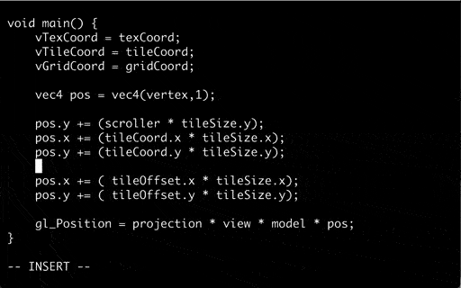

# FACADE Shader Development

--

## Overview

* Clone the FACADE repository:

		cd /path/to/
		git clone https://github.com/FEEDFACE-COM/facade.git

* Copy an existing shader:

		cp shader/lines/rows.vert shader/lines/foobar.vert	        

* Run FACADE renderer with `-dir=` option:

		facade -d render -dir /path/to/facade/ lines -shape foobar -color debug
		
  Use the `-color debug` style to see each tile.
		
* Edit the `shader/lines/foobar.vert` shader and save file to disk.  
  The FACADE renderer will reload the shader and apply the changes directly.
  

